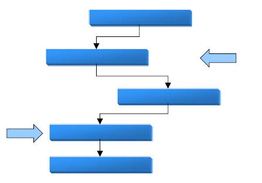
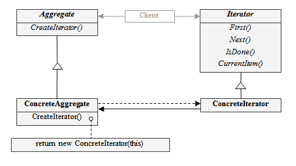

# Iterator Pattern

## 1. Iterator Pattern 이란?

- 객체 요소들의 내부 표현방식을 공개하지 않고, 객체에서 되지 않은, 외부에서 객체에 순회하는 객체를 만든다.



## 2. 의도 (Intent)와 동기(Motivation)

- 내부에서 객체의 순차적인 제공을 하지 않음

- 순회 구현 방식이 다르더라도 동일한 방식(메서드)로 순회 할 수 있게 제공

- 여러 리스트 객체에 대한 동일한 방식으로 순회하는 방법을 제공하기 위해 순회하는 객체를 따로만듬

예) Java Collection Framework의 Iterator

## 3. Class diagram




## 4. 객체 협력 (collaborations)

- **Iterator**

요소에 접근하고 순회하는데 필요한 메서드 제공

- **CocreteIterator**

Iterator에 정의된 인터페이스를 구현하는 클래스 

- **Aggregate**

Iterator 객체를 생성하는 인터페이스 정의

- **ConcreteAggregate**

해당하는 ConcreteIteratir의 인스턴스를 반환하도록 Iterator 생성 인터페이스를 구현

## 5. 중요한 결론 (consequence)

- ConcreteIterator는 리스트를 순회하면서 각 리스트의 요소를 반환하는 메서드도 제공한다.

- 다양한 순회방법이 제공될 수 있다.

- 동일한 Aggregate를 구현한 클래스들은 동일한 방식으로 순회할 수 있다.

## 6. 예제 

Iterator.java
```
public interface Iterator {
    public abstract boolean hasNext();
    public abstract Object next();

}
```

Aggregate.java
```
public interface Aggregate {
    public abstract Iterator iterator(int type);
    public int getLength();
    
}
```

Book.java
```
public class Book {
    private String name = "";
    public Book(String name) {
        this.name = name;
    }
    public String getName() {
        return name;
    }
}
```

BookShelf.java
```
public class BookShelf implements Aggregate {
    private Book[] books;
    private int last = 0;
    Factory f = IteratorFactory.getInstance();
   
    public BookShelf(int maxsize) {
        this.books = new Book[maxsize];
    }
    public Book getBookAt(int index) {
        return books[index];
    }
    public void appendBook(Book book) {
        this.books[last] = book;
        last++;
    }
    public int getLength() {
        return last;
    }
    public Iterator iterator(int type) {
    	Iterator i = f.create(this, type);
        return i;
    }
   	
}
```

Constant.java
```
public class Constant {
	public static final int FORWARD = 0;
	public static final int REVERSE = 1;
	
}
```

Factory.java
```
public abstract class Factory {
    public final Iterator create(Aggregate list, int type) {
    	Iterator p = createProduct(list, type);
        return p;
    }
    protected abstract Iterator createProduct(Aggregate list, int type);
}
```

IteratorFactory.java
```
public class IteratorFactory extends Factory {

	private static IteratorFactory ifactory = new IteratorFactory();
	private IteratorFactory(){}
	
	public static IteratorFactory getInstance(){
		
		if(ifactory == null)
			ifactory = new IteratorFactory();
		return ifactory;
	}
	
	@Override
	protected Iterator createProduct(Aggregate bookShelf, int type) {
		if(type == Constant.FORWARD)
			return new BookShelfIterator(bookShelf);
		else if(type == Constant.REVERSE)
			return new ReverseIterator(bookShelf);
		else 
			return null;
	}

}
```

BookShelfIterator.java
```
public class BookShelfIterator implements Iterator{
    private BookShelf bookShelf;
    private int index;
    
    BookShelfIterator(Aggregate bookShelf) {
        this.bookShelf = (BookShelf)bookShelf;
        this.index = 0;
    }
    public boolean hasNext() {
        if (index < bookShelf.getLength()) {
            return true;
        } else {
            return false;
        }
    }
    public Object next() {
        Book book = bookShelf.getBookAt(index);
        index++;
        return book;
    }

}
```

ReverseIterator.java
```
public class ReverseIterator  implements Iterator {
	private BookShelf bookShelf;
    private int index;

    ReverseIterator(Aggregate bookShelf) {
        this.bookShelf = (BookShelf)bookShelf;
        this.index = bookShelf.getLength() -1;
    }
	public boolean hasNext() {
	 if (index >= 0 ) {
            return true;
        } else {
            return false;
        }

	}
	@Override
	public Object next() {
		 Book book = bookShelf.getBookAt(index);
	     index--;
	     return book;
	}

}
```

Main.java
```
public class Main {
    public static void main(String[] args) {
        BookShelf bookShelf = new BookShelf(4);
        bookShelf.appendBook(new Book("Around the World in 80 Days"));
        bookShelf.appendBook(new Book("Bible"));
        bookShelf.appendBook(new Book("Cinderella"));
        bookShelf.appendBook(new Book("Daddy-Long-Legs"));
        
        Iterator it = bookShelf.iterator(Constant.FORWARD);
        while (it.hasNext()) {
            Book book = (Book)it.next();
            System.out.println("" + book.getName());
        }
        
        System.out.println("============");
        
        it = bookShelf.iterator(Constant.REVERSE);
        while (it.hasNext()) {
            Book book = (Book)it.next();
            System.out.println("" + book.getName());
        }
    }
    
    
}
```


