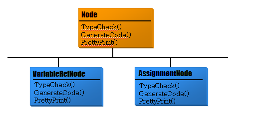
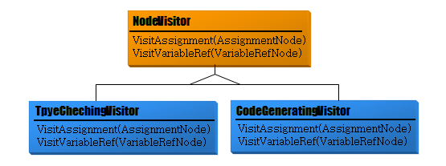
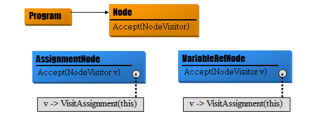
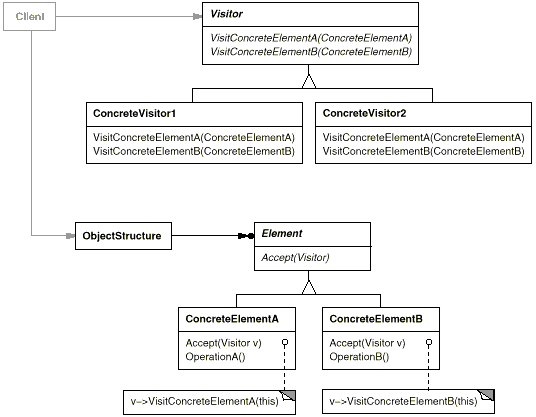

# Visitor Pattern

## 1. Visitor Pattern 이란?

- 구조 안을 돌아다니며 일을 함 "방문자"


- 객체 구조의 요소들이 수행해야할 기능을 모아둔 패턴

- 각 객체 요소를 변경하지 않고, 기능을 추가할 수 있음

- 데이터의 구조와 처리를 분리하여 처리하는 부분을 객체로 만들어 각 데이터 구조를 돌아다니며 오퍼레이션이 수행되도록 함

- 각 데이터는 이러한 visitor를 accept 함

## 2. 의도 (Intent)와 동기(Motivation)

- 추상구문 트리의 예

- 문법적 처리를 위해 각 노드마다 수행해야 하는 기능을 따로 정의 해야함



- 유사한 오퍼레이션들이 여러 객체에 분산되어 있어서 디버깅이 어렵고, 가독성이 떨어짐

- 각 클래스로부터 관련한 클래스를 모아서 Visitor를 별도로 만들어줌



- 각 노드 클래스는 visitor가 방문하면 accept 하여 해당 노드에 대한 기능이 수행되도록 함



## 3. Class diagram




## 4. 객체 협력 (collaborations)

- **Visitor**

각 객체에서 수행해야 할 기능을 선언한다.

메서드의 이름은 요청을 받을 객체를 명시한다.

- **ConcreteVisitor**

Visitor 클래스에 선언된 메서드를 구현한다.

각 메서드는 객체에 해당하는 알고리즘을 구현한다.

- **Element**

Visitor가 수행될 수 있는 Accept() 메서드를 선언한다.

- **ConcreteElement**

매개변수로 Visitor를 받아주는 Accept()메서드를 구현한다.


- **ConcreteAggregate**

해당하는 ConcreteIteratir의 인스턴스를 반환하도록 Iterator 생성 인터페이스를 구현

## 5. 중요한 결론 (consequence)

- 여러 요소에 대해 유사한 기능의 메서드를 한곳에 모아서 관리하게 되고, 여러 클래스에 걸친 메서드를 추가하기 용이함

- 각 클래스에 대한 기능이 자주 변경되거나 알고리즘의 변화가 많을때 사용하는것이 효율적임

- 새로운 요소 클래스를 추가하게 되면 그에 해당되는 기능을 모든 Visitor에서 구현해하 함

- 따라서 요소의 변화가 거의 없고 기능의 추가 삭제가 자주 발생할때 사용하는것이 좋음

- 각 객체의 오퍼레이션이 외부에 노출되는 것이므로 객체지향 프로그래밍의 캡슐화 전략에 위배

- 주로 Composite 패턴에서 자주 사용될 수 있음

## 6. 예제 

Visitor.java
```
public abstract class Visitor {
    public abstract void visit(File file);
    public abstract void visit(Directory directory);
}
```

ListVisitor.java
```
public class ListVisitor extends Visitor {
    private String currentdir = "";                         // 현재 주목하고 있는 디렉토리명
   
    public void visit(File file) {                  // 파일을 방문했을 때 호출된다.
        System.out.println(currentdir + "/" + file);
    }
    
    public void visit(Directory directory) {   // 디렉토리를 방문했을 때 호출된다.
        System.out.println(currentdir + "/" + directory);
        String savedir = currentdir;
        currentdir = currentdir + "/" + directory.getName();
        Iterator<Entry> it = directory.iterator();
        while (it.hasNext()) {
            Entry entry = (Entry)it.next();
           // if(entry.getName() == "tmp")
           // 	continue;
            
            entry.accept(this);
            
        }
        currentdir = savedir;
    }
}
```

Acceptor.java
```
public interface Acceptor {
    public abstract void accept(Visitor v);
}
```

Entry.java
```
public abstract class Entry implements Acceptor {
    public abstract String getName();                                   // 이름을 얻는다.
    public abstract int getSize();                                      // 사이즈를 얻는다.
    public Entry add(Entry entry) throws FileTreatmentException {       // 엔트리를 추가
        throw new FileTreatmentException();
    }
    public Iterator iterator() throws FileTreatmentException {    // Iterator의 생성
        throw new FileTreatmentException();
    }
    public String toString() {                                          // 문자열 표현
        return getName() + " (" + getSize() + ")";
    }
}
```

File.java
```
public class File extends Entry {
    private String name;
    private int size;
    public File(String name, int size) {
        this.name = name;
        this.size = size;
    }
    public String getName() {
        return name;
    }
    public int getSize() {
        return size;
    }
    public void accept(Visitor v) {
        v.visit(this);
    }
}
```

Directory.java
```
public class Directory extends Entry {
    private String name;                    // 디렉토리의 이름
    private ArrayList<Entry> dir = new ArrayList<Entry>();      // 디렉토리 엔트리의 집합
    public Directory(String name) {         // 생성자
        this.name = name;
    }
    public String getName() {               // 이름을 얻는다.
        return name;
    }
    public int getSize() {                  // 사이즈를 얻는다.
        int size = 0;
        Iterator<Entry> it = dir.iterator();
        while (it.hasNext()) {
            Entry entry = (Entry)it.next();
            size += entry.getSize();
        }
        return size;
    }
    public Entry add(Entry entry) {         // 엔트리의 추가
        dir.add(entry);
        return this;
    }
    public Iterator<Entry> iterator() {      // Iterator의 생성
        return dir.iterator();
    }
    public void accept(Visitor v) {         // 방문자를 받아들임
        v.visit(this);
    }
}
```

Main.java
```
public class Main {
    public static void main(String[] args) {
        try {
            System.out.println("Making root entries...");
            Directory rootdir = new Directory("root");
            Directory bindir = new Directory("bin");
            Directory tmpdir = new Directory("tmp");
            Directory usrdir = new Directory("usr");
            rootdir.add(bindir);
            rootdir.add(tmpdir);
            rootdir.add(usrdir);
            bindir.add(new File("vi", 10000));
            bindir.add(new File("latex", 20000));
            rootdir.accept(new ListVisitor());              

            System.out.println("");
            System.out.println("Making user entries...");
            Directory Kim = new Directory("Kim");
            Directory Lee = new Directory("Lee");
            Directory Kang = new Directory("Kang");
            usrdir.add(Kim);
            usrdir.add(Lee);
            usrdir.add(Kang);
            Kim.add(new File("diary.html", 100));
            Kim.add(new File("Composite.java", 200));
            Lee.add(new File("memo.tex", 300));
            Kang.add(new File("game.doc", 400));
            Kang.add(new File("junk.mail", 500));
            rootdir.accept(new ListVisitor());             
        } catch (FileTreatmentException e) {
            e.printStackTrace();
        }
    }
}
```


FileTreatmentException.java
```
public class FileTreatmentException extends RuntimeException {
    public FileTreatmentException() {
    }
    public FileTreatmentException(String msg) {
        super(msg);
    }
}
```
