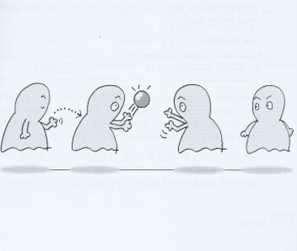
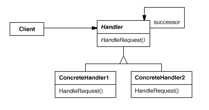

# Chain of Resposibility Pattern

## 1. Chain of Resposibility Pattern 이란?

- 책임 떠넘기기

- 다수의 객체를 사슬처럼 연결

- 요청을 처리할 수 있는 기회를 하나 이상의 객체에게 부여함

- 요청을 해결할 객체를 만날 때까지 객체 고리를 따라서 요청을 전달



## 2. 의도 (Intent)와 동기(Motivation)

- 메세지를 보내는 객체와 이를 받아서 처리하는 객체들 간의 결합도를 줄이기 위함

- 하나의 요청에 대한 처리가 반드시 한 객체에서만 이루어지는것이 아닌 여러 객체가 조건이 맞으면 처리의 기회를 가지게 됨

- HELP 시스템 같은 경우 적절한 답을 찾을 때 까지 연결되어 해결할 수 있음

## 3. Class diagram




## 4. 객체 협력 (collaborations)

- **Handler**

요청을 처리하는 인터페이스를 정의하고, 다음 번 처리자와의 연결을 구현한다.

연결고리에 연결된 다음 객체에게 다시 메세지를 보낸다

- **ConcreteHandler**

책임져야 할 메세지를 처리한다.

처리못하는 메세지는 다음 수신자에게 전달한다.

- **Client**

ConcreteHandler 객체에게 필요한 요청을 보낸다.


## 5. 중요한 결론 (consequence)

- 객체들 간의 결합도가 적어진다. 요청을 처리하는 객체와 요청을 보내는 객체가 서로 모를 수 있다.

- 연결순서는 상황에 따라 바뀌거나 추가 삭제될 수 있다. 즉 객체의 책임을 추가, 변경, 확장할 수 있다.

- 메세지가 항상 수신된다는것을 보장할 수 없다.

## 6. 예제 

Support.java
```
public abstract class Support {
    private String name;                    // 트러블 해결자의 이름
    private Support next;                   // 떠넘기는 곳
    public Support(String name) {           // 트러블 해결자의 생성
        this.name = name;
    }
    public Support setNext(Support next) {  // 떠넘길 곳을 설정
        this.next = next;
        return next;
    }
    public final void support(Trouble trouble) {  // 트러블 해결 순서
        if (resolve(trouble)) {
            done(trouble);
        } else if (next != null) {
            next.support(trouble);
        } else {
            fail(trouble);
        }
    }
    public String toString() {              // 문자열 표현
        return "[" + name + "]";
    }
    protected abstract boolean resolve(Trouble trouble); // 해결용 메소드
    protected void done(Trouble trouble) {  // 해결
        System.out.println(trouble + " is resolved by " + this + ".");
    }
    protected void fail(Trouble trouble) {  // 미해결
        System.out.println(trouble + " cannot be resolved.");
    }
}
```

LimitSupport.java
```
public class LimitSupport extends Support {
    private int limit;                              // 이 번호 미만이면 해결 할수 있다.
    public LimitSupport(String name, int limit) {   // 생성자
        super(name);
        this.limit = limit;
    }
    protected boolean resolve(Trouble trouble) {         // 해결용 메소드
        if (trouble.getNumber() < limit) {
            return true;
        } else {
            return false;
        }
    }
}
```

SpecialSupport.java
```
public class SpecialSupport extends Support {
    private int number;                                 // 이 번호만 해결할 수 있다.
    public SpecialSupport(String name, int number) {    // 생성자
        super(name);
        this.number = number;
    }
    protected boolean resolve(Trouble trouble) {     // 해결용 메소드 
        if (trouble.getNumber() == number) {
            return true;
        } else {
            return false;
        }
    }
}
```

OddSupport.java
```
public class OddSupport extends Support {
    public OddSupport(String name) {                // 생성자
        super(name);
    }
    protected boolean resolve(Trouble trouble) {    // 해결용 메소드
        if (trouble.getNumber() % 2 == 1) {
            return true;
        } else {
            return false;
        }
    }
}
```

NoSupport.java
```
public class NoSupport extends Support {
    public NoSupport(String name) {
        super(name);
    }
    protected boolean resolve(Trouble trouble) {     // 해결용 메소드
        return false; // 자신은 아무 처리도 하지 않는다.
    }
}
```

Main.java
```
public class Main {
    public static void main(String[] args) {
        Support alice   = new NoSupport("Alice");
        Support bob     = new LimitSupport("Bob", 100);
        Support charlie = new SpecialSupport("Charlie", 429);
        Support diana   = new LimitSupport("Diana", 200);
        Support elmo    = new OddSupport("Elmo");
        Support fred    = new LimitSupport("Fred", 300);
        // 연쇄의 형성
        alice.setNext(bob).setNext(charlie).setNext(diana).setNext(elmo).setNext(fred);
        // 다양한 트러블 발생
        for (int i = 0; i < 500; i += 33) {
            alice.support(new Trouble(i));
        }
    }
}
```


