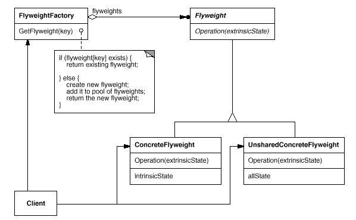

# Flyweight Pattern

## 1. Flyweight Pattern 이란?

- 공유 할 수 있는 객체는 공유하여 사용한다.

- 규모가 작고, 인스턴스마다 특성이 따로 없다면 공유해서 사용할 수 있다.


## 2. 의도 (Intent)와 동기(Motivation)

- 각 단어를 각각 표현하기보다는 문자를 공유하여 표현하면 비용이 훨씬적게 소요됨

- 각 객체가 부가적인 상태 (글꼴등...)이 있다면 따로 관리해야 하는 경우가 있음

- 작은 여러개의 객체를 관리해야 할때 주로 사용


## 3. Class diagram




## 4. 객체 협력 (collaborations)

- **Flyweight**

각 객체가 사용할 인터페이스를 정의한다.

- **CocreteFlyweight**

공유될 수 있는 실제적 객체를 구현

- **UnSharedCocreteFlyweight**

각 인스턴스마다 가지게 되는 부가적인 특성이 있다면 구현한다.

- **FlyweightFactory**

Flyweight에 pool을 관리한다. 각 Flyweight 객체는 Singleton으로 생성한다.

## 5. 중요한 결론 (consequence)

- 공유를 통하여 인스턴스의 수를 절약한다.

- 인스턴스마다의 특성이 거의 없는 객체에 사용하는 것이 효율적이다. 

- 부가적인 정보가 많은 경우는 비효율적일 수 있다.

## 6. 예제 

BigChar.java
```
public class BigChar {
   
    private char charname;
    private String fontdata;
   
    public BigChar(char charname) {
        this.charname = charname;
        try {
            BufferedReader reader = new BufferedReader(
                new FileReader("big" + charname + ".txt")
            );
            String line;
            StringBuffer buf = new StringBuffer();
            while ((line = reader.readLine()) != null) {
                buf.append(line);
                buf.append("\n");
            }
            reader.close();
            this.fontdata = buf.toString();
        } catch (IOException e) {
            this.fontdata = charname + "?";
        }
    }
    // 큰 문자를 표시한다.
    public void print() {
        System.out.print(fontdata);
    }
}
```

BigCharFactory.java
```
public class BigCharFactory {
   
    private Hashtable<String,BigChar> pool = new Hashtable<String,BigChar>();
    
    private static BigCharFactory singleton = new BigCharFactory();
    
    private BigCharFactory() {
    }
    
    public static BigCharFactory getInstance() {
        return singleton;
    }
    
    public synchronized BigChar getBigChar(char charname) {
        BigChar bc = pool.get("" + charname);
        if (bc == null) {
            bc = new BigChar(charname); // 여기에서 BigChar의 인스턴스를 생성
            pool.put("" + charname, bc);
        }
        return bc;
    }
}
```

BigString.java
```
public class BigString {
    // "큰 문자"의 배열
    private BigChar[] bigchars;
    // 생성자
    public BigString(String string) {
        bigchars = new BigChar[string.length()];
        BigCharFactory factory = BigCharFactory.getInstance();
        for (int i = 0; i < bigchars.length; i++) {
            bigchars[i] = factory.getBigChar(string.charAt(i));
        }
    }
    // 표시
    public void print() {
        for (int i = 0; i < bigchars.length; i++) {
            bigchars[i].print();
        }
    }
}
```
Main.java
```
public class Main {
    public static void main(String[] args) {
   
        BigString bs = new BigString("123abc123");
        bs.print();
    }
}
```

