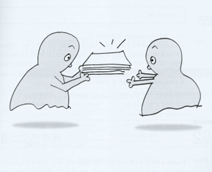
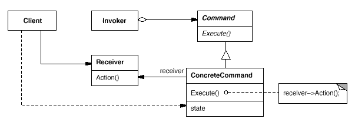

# Command Pattern

## 1. Command Pattern 이란?

- 명령을 클래스로 만듬

## 2. 의도 (Intent)와 동기(Motivation)

- 요청을 객체로 만들어 전달한다.

- 요청을 기록으로 남겨 취소도 가능하도록 한다.

- 클라이언트 서버간의 프로토콜로 사용할 수 있다.

예) 메뉴, 프로토콜

## 3. Class diagram

## 4. 객체 협력 (collaborations)

- **Command**

각 명령이 수행할 메서드 선언

- **CocreteCommand**

실제 명령이 호출되도록 execute 구현

- **Client**

ConcreteCommand 객체를 생성하고 처리 객체로 정의

- **Invoker**

Command 처리를 수행할 것을 요청

- **Receiver**

Command를 처리함

## 5. 중요한 결론 (consequence)

- 명령 자체를 객체화 하여 여러 다른 객체에 명령이 전달되거나 명령이 조합될 수도 있다.

- 새로운 프로토콜이 추가되기 쉽다.

- 부가적인 정보가 많은 경우는 비효율적일 수 있다.

## 6. 예제 
