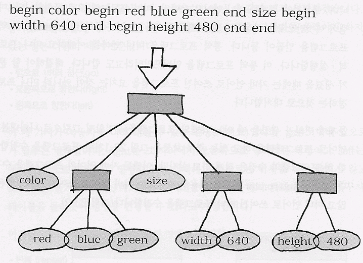
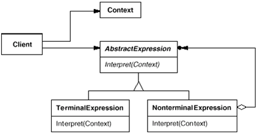
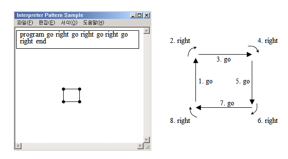
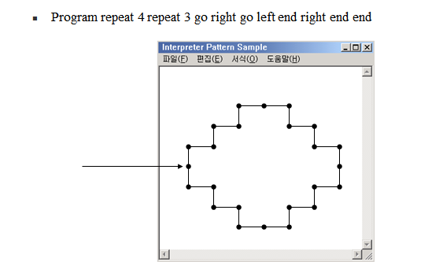
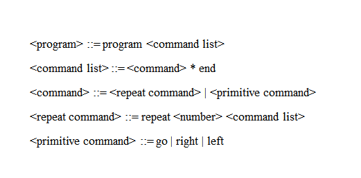
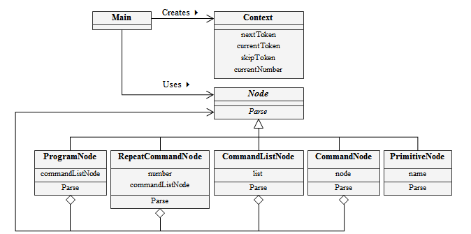

# Interpreter Pattern

## 1. Interpreter Pattern 이란?

- 문법 규칙을 클래스로 표현

- 간단한 프로그램을 해석하기 위한 패턴



## 2. 의도 (Intent)와 동기(Motivation)

- 간단한 언어에 대한 해석기 패턴

- 각 문법에 대한 해석을 클래스로 표현

- 미니언어나 게임에서 사용하는 간단한 언어에 대한 문법 해석기


## 3. Class diagram




## 4. 객체 협력 (collaborations)

- **AbstractExpress**

추상 구문 트리에 속한 모든 노드가 가져야할 공통의 메서드 interpte() 오퍼레이션 선언

- **TerminalExpression**

터미널 기호에 대한 해석방법을 구현

- **NonterminalExpression**

재귀적으로 호출되어 다른 AbstractExpression으로 구문을 패쓰하게 된다. 

- **Context**

번역기에 대한 포괄적인 정보 포함

- **Client**

Syntax를 실제로 정의하고 추상 구문 트리를 생성하고 각 문법 표현 클래스의 interpret() 메서드를 호출한다.

## 5. 중요한 결론 (consequence)

- 문법의 변경이나 확장이 쉽고

- 문법의 구현이 쉽다.

- 복잡한 문법은 사용할 수 없다.

## 6. 예제 

자동차를 움직이는 간단한 언어

프로그램의 시작: program
프로그램의 끝   : end

자동차를 움직이게 하는 명령들
    go : 앞으로 1미터 전진
    right : 오른쪽으로 향함
    left : 왼쪽으로 향함
    repeat : 반복명령





**Grammar 정의**



**Grammar Diagram**




Node.java
```
public abstract class Node {
    public abstract void parse(Context context) throws ParseException;
}
```

ProgramNode.java
```
// <program> ::= program <command list>
public class ProgramNode extends Node {
    private Node commandListNode;
    public void parse(Context context) throws ParseException {
        context.skipToken("program");
        commandListNode = new CommandListNode();
        commandListNode.parse(context);
    }
    public String toString() {
        return "[program " + commandListNode + "]";
    }
}
```

CommandListNode.java
```
// <command list> ::= <command>* end
public class CommandListNode extends Node {
    private Vector list = new Vector();
    public void parse(Context context) throws ParseException {
        while (true) {
            if (context.currentToken() == null) {
                throw new ParseException("Missing 'end'");
            } else if (context.currentToken().equals("end")) {
                context.skipToken("end");
                break;
            } else {
                Node commandNode = new CommandNode();
                commandNode.parse(context);
                list.add(commandNode);
            }
        }
    }
    public String toString() {
        return "" + list;
    }
}
```

CommandNode.java
```
// <command> ::= <repeat command> | <primitive command>
public class CommandNode extends Node {
    private Node node;
    public void parse(Context context) throws ParseException {
        if (context.currentToken().equals("repeat")) {
            node = new RepeatCommandNode();
            node.parse(context);
        } else {
            node = new PrimitiveCommandNode();
            node.parse(context);
        }
    }
    public String toString() {
        return node.toString();
    }
}
```

RepeateCommandNode.java
```
// <repeat command> ::= repeat <number> <command list>
public class RepeatCommandNode extends Node {
    private int number;
    private Node commandListNode;
    public void parse(Context context) throws ParseException {
        context.skipToken("repeat");
        number = context.currentNumber();
        context.nextToken();
        commandListNode = new CommandListNode();
        commandListNode.parse(context);
    }
    public String toString() {
        return "[repeat " + number + " " + commandListNode + "]";
    }
}
```

PrimitiveCommandNode.java
```
// <primitive command> ::= go | right | left
public class PrimitiveCommandNode extends Node {
    private String name;
    public void parse(Context context) throws ParseException {
        name = context.currentToken();
        context.skipToken(name);
        if (!name.equals("go") && !name.equals("right") && !name.equals("left")) {
            throw new ParseException(name + " is undefined");
        }
    }
    public String toString() {
        return name;
    }
}
```

Context.java
```
public class Context {
    private StringTokenizer tokenizer;
    private String currentToken;
    public Context(String text) {
        tokenizer = new StringTokenizer(text);
        nextToken();
    }
    public String nextToken() {
        if (tokenizer.hasMoreTokens()) {
            currentToken = tokenizer.nextToken();
        } else {
            currentToken = null;
        }
        return currentToken;
    }
    public String currentToken() {
        return currentToken;
    }
    public void skipToken(String token) throws ParseException {
        if (!token.equals(currentToken)) {
            throw new ParseException("Warning: " + token + " is expected, but " + currentToken + " is found.");
        }
        nextToken();
    }
    public int currentNumber() throws ParseException {
        int number = 0;
        try {
            number = Integer.parseInt(currentToken);
        } catch (NumberFormatException e) {
            throw new ParseException("Warning: " + e);
        }
        return number;
    }
}
```

ParseException.java
```
public class ParseException extends Exception {
    public ParseException(String msg) {
        super(msg);
    }
}
```

Main.java
```
public class Main {
    public static void main(String[] args) {
        try {
            BufferedReader reader = new BufferedReader(new FileReader("program.txt"));
            String text;
            while ((text = reader.readLine()) != null) {
                System.out.println("text = \"" + text + "\"");
                Node node = new ProgramNode();
                node.parse(new Context(text));
                System.out.println("node = " + node);
            }
        } catch (Exception e) {
            e.printStackTrace();
        }
    }
}
//program repeat 4 go right end end
```

program end

program go end

program go right go right go right go right end

program repeat 4 go right end end

program repeat 4 repeat 3 go right go left end right end end


